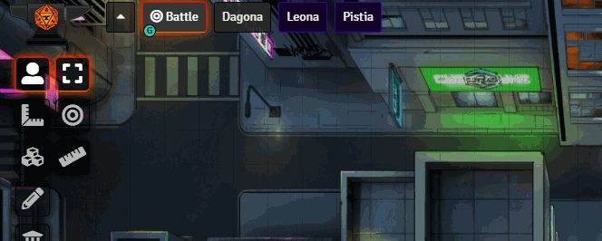

# Scene Preview
### _Created by: JeansenVaars_ - [Invite me to a Coffee](#by-jeansenvaars) :) if you like this module!

Shows the GM a preview image of the scene, on moving the mouse over the scene navigation scenes.

This was formerly part of **Minimal UI** but it was ripped off for better flexibility and independence.

**Recommended with Minimal UI**

## By JeansenVaars

## Check out my other modules!
* Minimal UI (Recommended combination!)
* Window Controls
* Super Select

# Appreciations
* Thanks to the FoundryVTT Discord community for the amazing issue reports and feedback.

# License
[MIT License](./LICENSE.md)

# Powered By

Thanks to JetBrains I can work on this project using **WebStorm**.
